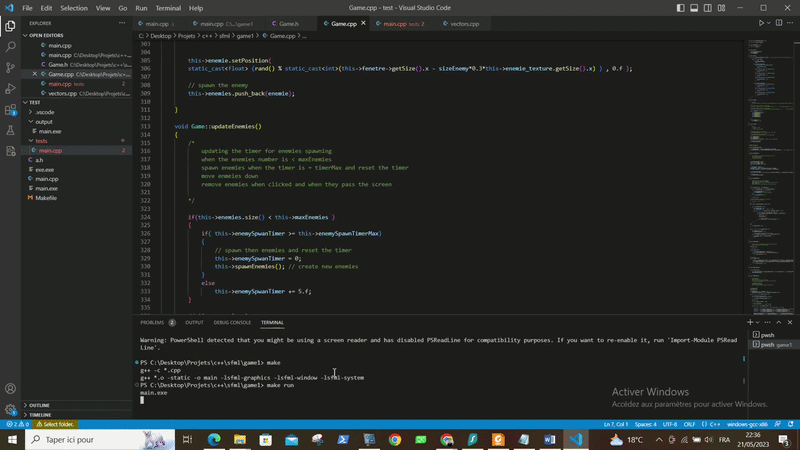

# 🚀 Galaxy Shooter (C++ / SFML)

A **2D Shoot 'Em Up** game developed in **C++** using the **SFML** library. This project was created to deepen my understanding of object-oriented programming, graphics resource management, collision detection, and 2D game development.

The player controls a spaceship that can move horizontally and shoot at enemies appearing progressively on the screen. The objective is to survive as long as possible by destroying as many enemies as possible while preventing them from reaching the player.

▶️ Full gameplay video: 🔗 [Portfolio: https://babderraouf.github.io/portfolio/](https://babderraouf.github.io/portfolio/)

---

# 📷 Preview

> Add a screenshot or GIF of the game here.

```text

```

---

# ✨ Features

- 🎮 Smooth player movement
- 🚀 Shooting system
- 👾 Random enemy spawning
- ⬇️ Automatic enemy movement
- 💥 Collision detection
  - Projectile ↔ Enemy
  - Enemy ↔ Player
- ❤️ Health system
- 🏆 Score system
- 🧹 Automatic removal of off-screen objects
- 🎨 Sprites and textures
- 🪟 SFML game window

---

# 🛠️ Technologies Used

- **C++**
- **SFML (Simple and Fast Multimedia Library)**
- **Visual Studio**
- **Object-Oriented Programming (OOP)**

SFML is a multimedia library that makes it easy to develop graphics applications, audio applications, and 2D games in C++.

---

# 📁 Project Structure

```text
GalaxyShooter/
│
├── src/
│   ├── Game.cpp
│   ├── main.cpp
│   └── ...
│
├── include/
│   ├── Game.h
│   └── ...
│
├── assets/
│   ├── images/
│   ├── fonts/
│   └── ...
│
├── README.md
│
└── GalaxyShooter.sln
```

---

# 🎮 Controls

| Key | Action |
|-----|--------|
| ← | Move left |
| → | Move right |
| Space | Shoot |
| Esc | Quit the game |

---

# ⚙️ Build Instructions

## Prerequisites

- Visual Studio 2019 or 2022
- SFML installed and configured
- A C++17-compatible compiler (or the one used by the project)

---

## Installation

Clone the repository:

```bash
git clone https://github.com/bAbderraouf/SFML_GalaxyShooter_Cpp.git
```

Then open the `.sln` solution file with Visual Studio.

Make sure SFML is properly configured in your project:

- Include Directories
- Library Directories
- Additional Dependencies

Finally, build the project in either **Debug** or **Release** mode.

---

# 🧠 C++ Concepts Demonstrated

This project puts several important C++ concepts into practice:

- Classes
- Encapsulation
- Constructors
- Destructors
- Vectors (`std::vector`)
- Iterators
- Dynamic object management
- Game loop
- Event handling
- Collision detection
- Resource management
- Real-time programming

---

# 🎯 Gameplay

## Player

The player can:

- Move horizontally
- Shoot projectiles
- Lose health when hit by an enemy

---

## Enemies

Enemies:

- Spawn randomly
- Move downward continuously
- Are removed when they leave the screen
- Are destroyed when hit by a projectile

---

## Collision System

Two types of collisions are handled:

### Projectile ↔ Enemy

When a projectile hits an enemy:

- The projectile is removed
- The enemy is destroyed
- The score is updated

### Enemy ↔ Player

When an enemy reaches the player:

- The enemy disappears
- The player loses one health point

---

# 🏗️ Architecture

The project is centered around the main `Game` class, responsible for:

- Initializing the game
- Running the main game loop
- Handling user input and events
- Updating game objects
- Rendering graphics

Some of the main methods include:

```cpp
initWindow()
initPlayer()
generateEnemies()
generateShoots()

update()
updateEnemies()
updateShoots()

render()
```

This separation of responsibilities results in cleaner, more maintainable, and scalable code.

---

# 🚧 Future Improvements

Possible future enhancements include:

- 🔊 Background music and sound effects
- 👑 Boss battles
- 🌌 Multiple levels
- 💣 Different enemy types
- 🚀 Spaceship upgrades
- ❤️ Health pickups
- ⚡ Power-ups
- 🎯 Multiple weapon types
- 📈 Progressive difficulty
- 💾 High score saving
- 📜 Main menu
- ⏸️ Pause menu
- ⚙️ Settings menu
- 🎮 Game controller support
- 🖥️ Fullscreen mode

---

# 📚 What I Learned

This project helped me improve my understanding of:

- Object-Oriented Programming in C++
- Designing and implementing a game loop
- Managing sprites and textures with SFML
- Handling keyboard input
- Collision detection techniques
- Using STL containers
- Safely removing elements with iterators
- Organizing a medium-sized C++ project

---

# 🤝 Contributing

Contributions are welcome!

If you'd like to improve this project:

1. Fork the repository.
2. Create a new branch.
3. Make your changes.
4. Open a Pull Request.

---

# 📄 License

This project is distributed for educational purposes.

You are free to use, modify, and learn from it.

---

## 👤 Author

**Abderraouf B.**

GitHub: https://github.com/bAbderraouf

Portfolio: https://babderraouf.github.io/portfolio

If you found this project useful, consider giving it a ⭐ on GitHub!
